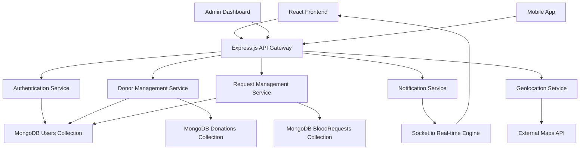
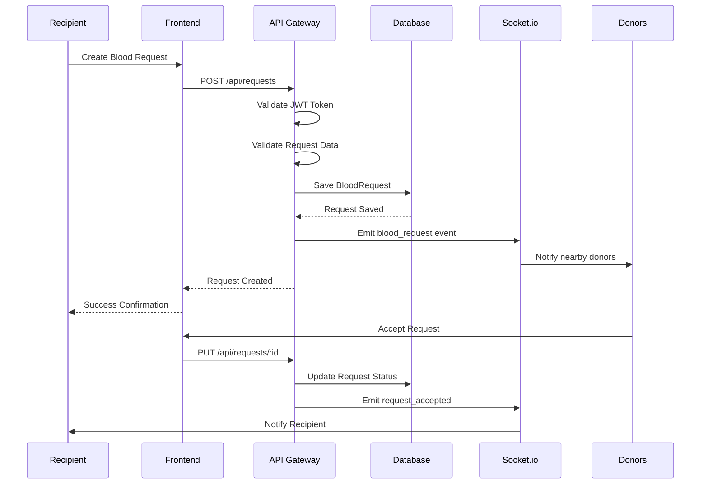
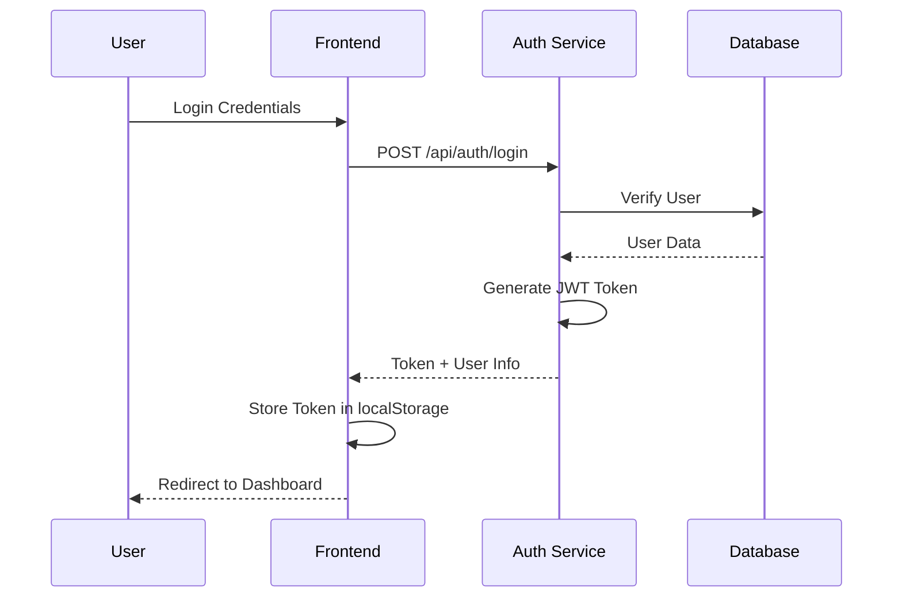

# Design Document: Blood Donation Platform

## Overview

A comprehensive blood donation management system that connects blood donors with recipients through a modern web platform. The system provides real-time matching, emergency request handling, donation tracking, and secure user management across a React frontend, Node.js backend, and MongoDB database architecture.

## Architecture



## Sequence Diagrams

### Blood Request Flow



### User Authentication Flow



## Components and Interfaces

### Frontend Components

#### Authentication Component
```typescript
interface AuthContextType {
  user: User | null;
  token: string | null;
  login: (credentials: LoginCredentials) => Promise<void>;
  register: (userData: RegisterData) => Promise<void>;
  logout: () => void;
  isAuthenticated: boolean;
}

interface LoginCredentials {
  email: string;
  password: string;
  role: 'donor' | 'recipient';
}

interface RegisterData {
  name: string;
  email: string;
  password: string;
  phone: string;
  bloodType: BloodType;
  city: string;
  role: 'donor' | 'recipient';
}
```

**Responsibilities**:
- User authentication state management
- JWT token handling
- Login/logout functionality
- Registration process management

#### Donor Management Component
```typescript
interface DonorService {
  findNearbyDonors: (location: Coordinates, bloodType: BloodType) => Promise<Donor[]>;
  updateAvailability: (donorId: string, available: boolean) => Promise<void>;
  getDonorProfile: (donorId: string) => Promise<Donor>;
  updateDonorProfile: (donorId: string, updates: Partial<Donor>) => Promise<Donor>;
}

interface Donor {
  _id: string;
  name: string;
  bloodType: BloodType;
  location: Coordinates;
  available: boolean;
  lastDonation: Date;
  verified: boolean;
  totalDonations: number;
}
```

**Responsibilities**:
- Donor profile management
- Availability status tracking
- Geolocation-based donor search
- Donation history management

#### Request Management Component
```typescript
interface RequestService {
  createRequest: (request: BloodRequestData) => Promise<BloodRequest>;
  updateRequestStatus: (requestId: string, status: RequestStatus) => Promise<void>;
  getNearbyRequests: (location: Coordinates) => Promise<BloodRequest[]>;
  acceptRequest: (requestId: string, donorId: string) => Promise<void>;
}

interface BloodRequestData {
  bloodType: BloodType;
  quantity: number;
  urgency: 'urgent' | 'high' | 'normal';
  reason: string;
  hospital: string;
  location: Coordinates;
}
```

**Responsibilities**:
- Blood request creation and management
- Request status tracking
- Donor-recipient matching
- Emergency request prioritization

### Backend Services

#### Authentication Service
```typescript
interface AuthService {
  register: (userData: RegisterData) => Promise<AuthResponse>;
  login: (credentials: LoginCredentials) => Promise<AuthResponse>;
  verifyToken: (token: string) => Promise<User>;
  refreshToken: (refreshToken: string) => Promise<AuthResponse>;
}

interface AuthResponse {
  token: string;
  refreshToken: string;
  user: User;
  expiresIn: number;
}
```

**Responsibilities**:
- User registration and authentication
- JWT token generation and validation
- Password hashing and verification
- Session management

#### Notification Service
```typescript
interface NotificationService {
  sendBloodRequestNotification: (request: BloodRequest, nearbyDonors: Donor[]) => Promise<void>;
  sendRequestAcceptedNotification: (request: BloodRequest) => Promise<void>;
  sendDonationReminderNotification: (donation: Donation) => Promise<void>;
  broadcastEmergencyAlert: (request: BloodRequest) => Promise<void>;
}
```

**Responsibilities**:
- Real-time notifications via Socket.io
- Email notifications
- SMS alerts for emergencies
- Push notifications for mobile

## Data Models

### User Model
```typescript
interface User {
  _id: string;
  name: string;
  email: string;
  password: string; // hashed
  phone: string;
  role: 'donor' | 'recipient' | 'admin';
  bloodType: BloodType;
  location: {
    city: string;
    state: string;
    coordinates: Coordinates;
  };
  profile: {
    age: number;
    weight: number;
    verified: boolean;
    profilePicture?: string;
  };
  donorInfo?: {
    available: boolean;
    lastDonation: Date;
    totalDonations: number;
    eligibilityDate: Date;
  };
  createdAt: Date;
  updatedAt: Date;
}
```

**Validation Rules**:
- Email must be unique and valid format
- Password minimum 8 characters with special characters
- Phone number must be valid format
- Blood type must be one of: A+, A-, B+, B-, AB+, AB-, O+, O-
- Age must be between 18-65 for donors
- Weight must be minimum 50kg for donors

### BloodRequest Model
```typescript
interface BloodRequest {
  _id: string;
  requester: string; // User ID
  bloodType: BloodType;
  quantity: number; // in units
  urgency: 'urgent' | 'high' | 'normal';
  reason: string;
  hospital: {
    name: string;
    address: string;
    contact: string;
  };
  location: Coordinates;
  status: 'pending' | 'accepted' | 'completed' | 'cancelled' | 'expired';
  acceptedBy?: string; // Donor ID
  responses: RequestResponse[];
  expiresAt: Date;
  createdAt: Date;
  updatedAt: Date;
}

interface RequestResponse {
  donor: string; // User ID
  status: 'interested' | 'accepted' | 'declined';
  message?: string;
  respondedAt: Date;
}
```

**Validation Rules**:
- Quantity must be between 1-10 units
- Urgency level affects notification priority
- Requests expire after 48 hours if not accepted
- Hospital contact must be verified

### Donation Model
```typescript
interface Donation {
  _id: string;
  donor: string; // User ID
  recipient: string; // User ID
  bloodRequest: string; // BloodRequest ID
  bloodType: BloodType;
  quantity: number;
  location: {
    hospital: string;
    address: string;
    coordinates: Coordinates;
  };
  status: 'scheduled' | 'completed' | 'cancelled' | 'no_show';
  scheduledDate: Date;
  completedDate?: Date;
  notes?: string;
  verification: {
    verified: boolean;
    verifiedBy?: string; // Admin/Hospital ID
    verificationDate?: Date;
  };
  createdAt: Date;
  updatedAt: Date;
}
```

**Validation Rules**:
- Scheduled date must be within 7 days of request
- Donor must be eligible (90 days since last donation)
- Blood type compatibility must be verified
- Verification required for completion

## Algorithmic Pseudocode

### Main Blood Request Processing Algorithm

```typescript
async function processBloodRequest(requestData: BloodRequestData, requesterId: string): Promise<BloodRequest> {
  // Preconditions: requestData is validated, requesterId exists
  
  // Step 1: Create blood request
  const request = await createBloodRequest({
    ...requestData,
    requester: requesterId,
    status: 'pending',
    expiresAt: new Date(Date.now() + 48 * 60 * 60 * 1000) // 48 hours
  });
  
  // Step 2: Find compatible donors
  const compatibleDonors = await findCompatibleDonors(
    requestData.bloodType,
    requestData.location,
    50 // 50km radius
  );
  
  // Step 3: Filter eligible donors
  const eligibleDonors = compatibleDonors.filter(donor => 
    donor.available && 
    isEligibleToDonate(donor.lastDonation) &&
    donor.verified
  );
  
  // Step 4: Sort by priority (distance, last donation, total donations)
  const prioritizedDonors = sortDonorsByPriority(eligibleDonors, requestData.location);
  
  // Step 5: Send notifications
  await sendNotificationsToDonors(request, prioritizedDonors, requestData.urgency);
  
  // Step 6: Set up auto-expiration
  scheduleRequestExpiration(request._id, request.expiresAt);
  
  return request;
}
```

**Preconditions**:
- requestData contains valid blood type, quantity, and location
- requesterId corresponds to existing verified user
- User has not exceeded daily request limit (max 1 per day)

**Postconditions**:
- BloodRequest created in database with 'pending' status
- Compatible donors notified within 5 minutes
- Request automatically expires after 48 hours if not accepted
- Audit log entry created for request

**Loop Invariants**:
- All processed donors are compatible with requested blood type
- All notified donors are verified and eligible
- Notification order maintains priority ranking

### Donor Matching Algorithm

```typescript
async function findCompatibleDonors(
  requestedBloodType: BloodType, 
  location: Coordinates, 
  radiusKm: number
): Promise<Donor[]> {
  
  // Step 1: Determine compatible blood types
  const compatibleTypes = getCompatibleBloodTypes(requestedBloodType);
  
  // Step 2: Query donors within radius
  const nearbyDonors = await Donor.find({
    bloodType: { $in: compatibleTypes },
    'location.coordinates': {
      $near: {
        $geometry: { type: 'Point', coordinates: [location.longitude, location.latitude] },
        $maxDistance: radiusKm * 1000 // Convert to meters
      }
    },
    available: true,
    verified: true
  });
  
  // Step 3: Calculate distances and eligibility
  const processedDonors = nearbyDonors.map(donor => ({
    ...donor.toObject(),
    distance: calculateDistance(location, donor.location.coordinates),
    eligible: isEligibleToDonate(donor.lastDonation),
    priority: calculateDonorPriority(donor, location)
  }));
  
  // Step 4: Filter and sort
  return processedDonors
    .filter(donor => donor.eligible)
    .sort((a, b) => b.priority - a.priority);
}
```

**Preconditions**:
- requestedBloodType is valid blood type
- location contains valid latitude/longitude
- radiusKm is positive number

**Postconditions**:
- Returns array of compatible, eligible, verified donors
- Donors sorted by priority (distance, availability, donation history)
- All returned donors are within specified radius

**Loop Invariants**:
- All processed donors have compatible blood types
- Distance calculations are accurate within 1% margin
- Priority scores are consistently calculated

### Real-time Notification Algorithm

```typescript
async function sendNotificationsToDonors(
  request: BloodRequest, 
  donors: Donor[], 
  urgency: string
): Promise<void> {
  
  const notificationBatches = createNotificationBatches(donors, urgency);
  
  for (const batch of notificationBatches) {
    // Send Socket.io notifications
    for (const donor of batch.donors) {
      io.to(`donor_${donor._id}`).emit('blood_request', {
        request: sanitizeRequestForDonor(request),
        urgency: urgency,
        distance: batch.distance
      });
    }
    
    // Send email notifications for urgent requests
    if (urgency === 'urgent') {
      await sendBulkEmailNotifications(batch.donors, request);
    }
    
    // Delay between batches to prevent overwhelming
    if (batch.delay > 0) {
      await sleep(batch.delay);
    }
  }
  
  // Log notification metrics
  await logNotificationMetrics(request._id, donors.length, urgency);
}
```

**Preconditions**:
- request is valid BloodRequest object
- donors array contains verified, eligible donors
- urgency is one of: 'urgent', 'high', 'normal'

**Postconditions**:
- All eligible donors receive real-time notifications
- Urgent requests trigger immediate email notifications
- Notification delivery is logged for analytics
- Rate limiting prevents system overload

**Loop Invariants**:
- Each donor receives exactly one notification per request
- Notification content is sanitized (no sensitive data)
- Batch processing maintains delivery order

## Key Functions with Formal Specifications

### Function 1: authenticateUser()

```typescript
async function authenticateUser(email: string, password: string): Promise<AuthResult>
```

**Preconditions**:
- `email` is non-empty string with valid email format
- `password` is non-empty string
- Database connection is active

**Postconditions**:
- Returns AuthResult with success/failure status
- If successful: JWT token generated with 24-hour expiration
- If failed: Error message indicates specific failure reason
- User login attempt is logged for security monitoring

**Loop Invariants**: N/A (no loops in function)

### Function 2: validateBloodCompatibility()

```typescript
function validateBloodCompatibility(donorType: BloodType, recipientType: BloodType): boolean
```

**Preconditions**:
- `donorType` and `recipientType` are valid BloodType values
- Blood types are from set: {A+, A-, B+, B-, AB+, AB-, O+, O-}

**Postconditions**:
- Returns true if and only if donation is medically safe
- Follows universal blood compatibility rules
- No side effects on input parameters

**Loop Invariants**: N/A (lookup table operation)

### Function 3: calculateDonorEligibility()

```typescript
function calculateDonorEligibility(donor: Donor): EligibilityResult
```

**Preconditions**:
- `donor` object contains valid lastDonation date
- `donor.age` is between 18-65
- `donor.weight` is minimum 50kg

**Postconditions**:
- Returns EligibilityResult with eligible boolean and next eligible date
- Eligible if 90+ days since last donation (56 days for plasma)
- Next eligible date calculated based on donation type

**Loop Invariants**: N/A (date calculation function)

## Example Usage

```typescript
// Example 1: Creating a blood request
const requestData = {
  bloodType: 'O-',
  quantity: 2,
  urgency: 'urgent',
  reason: 'Emergency surgery',
  hospital: 'City General Hospital',
  location: { latitude: 40.7128, longitude: -74.0060 }
};

const request = await processBloodRequest(requestData, userId);

// Example 2: Finding compatible donors
const compatibleDonors = await findCompatibleDonors('AB+', userLocation, 25);

// Example 3: User authentication
const authResult = await authenticateUser('user@example.com', 'password123');
if (authResult.success) {
  localStorage.setItem('token', authResult.token);
  redirectToDashboard();
}

// Example 4: Real-time notification handling
socket.on('blood_request', (data) => {
  showNotification(`Urgent: ${data.request.bloodType} needed nearby`);
  updateDashboard(data.request);
});
```

## Correctness Properties

### Universal Quantification Statements

1. **Blood Compatibility Safety**:
   ```
   ∀ donation ∈ Donations: 
     validateBloodCompatibility(donation.donor.bloodType, donation.recipient.bloodType) = true
   ```

2. **Donor Eligibility Enforcement**:
   ```
   ∀ donation ∈ CompletedDonations:
     daysSince(donation.donor.lastDonation, donation.completedDate) ≥ 90
   ```

3. **Request Expiration Consistency**:
   ```
   ∀ request ∈ BloodRequests:
     request.status = 'expired' ⟹ now() > request.expiresAt
   ```

4. **Authentication Token Validity**:
   ```
   ∀ token ∈ ActiveTokens:
     verifyToken(token).valid = true ⟹ token.expiresAt > now()
   ```

5. **Geolocation Accuracy**:
   ```
   ∀ donor ∈ NearbyDonors(location, radius):
     calculateDistance(location, donor.location) ≤ radius
   ```

## Error Handling

### Error Scenario 1: Database Connection Failure

**Condition**: MongoDB connection is lost during operation
**Response**: 
- Return HTTP 503 Service Unavailable
- Log error with timestamp and context
- Attempt automatic reconnection with exponential backoff
**Recovery**: 
- Queue failed operations for retry
- Notify administrators via monitoring system
- Graceful degradation to cached data where possible

### Error Scenario 2: Invalid Blood Request Data

**Condition**: User submits request with invalid blood type or negative quantity
**Response**:
- Return HTTP 400 Bad Request with specific validation errors
- Log validation failure for analytics
- Preserve user input for correction
**Recovery**:
- Display user-friendly error messages
- Highlight invalid fields in form
- Provide suggestions for correction

### Error Scenario 3: JWT Token Expiration

**Condition**: User attempts protected operation with expired token
**Response**:
- Return HTTP 401 Unauthorized
- Clear client-side token storage
- Redirect to login page
**Recovery**:
- Attempt automatic token refresh if refresh token valid
- Preserve user's intended action for post-login redirect
- Show session timeout notification

### Error Scenario 4: Geolocation Service Failure

**Condition**: External maps API is unavailable or returns errors
**Response**:
- Fall back to city-based matching
- Log service failure for monitoring
- Continue operation with reduced accuracy
**Recovery**:
- Cache last known coordinates for users
- Retry geolocation service with circuit breaker pattern
- Notify users of reduced location accuracy

## Testing Strategy

### Unit Testing Approach

**Framework**: Jest with React Testing Library for frontend, Jest with Supertest for backend

**Key Test Categories**:
- Authentication functions (login, register, token validation)
- Blood compatibility validation
- Donor eligibility calculations
- Distance calculations and geolocation
- Data validation and sanitization
- Error handling and edge cases

**Coverage Goals**: Minimum 85% code coverage with 100% coverage for critical paths (authentication, blood compatibility, payment processing)

### Property-Based Testing Approach

**Property Test Library**: fast-check for JavaScript/TypeScript

**Key Properties to Test**:
1. **Blood Compatibility Transitivity**: If A can donate to B and B can donate to C, verify the relationship holds
2. **Distance Calculation Symmetry**: Distance from A to B equals distance from B to A
3. **Token Generation Uniqueness**: Generated JWT tokens are always unique
4. **Request Expiration Monotonicity**: Request expiration times are always in the future when created
5. **Donor Eligibility Consistency**: Eligibility calculation produces same result for same input

**Example Property Test**:
```typescript
fc.assert(fc.property(
  fc.record({
    bloodType: fc.constantFrom('A+', 'A-', 'B+', 'B-', 'AB+', 'AB-', 'O+', 'O-'),
    lastDonation: fc.date({ min: new Date('2020-01-01'), max: new Date() })
  }),
  (donor) => {
    const eligibility = calculateDonorEligibility(donor);
    const daysSince = (Date.now() - donor.lastDonation.getTime()) / (1000 * 60 * 60 * 24);
    return eligibility.eligible === (daysSince >= 90);
  }
));
```

### Integration Testing Approach

**Framework**: Jest with MongoDB Memory Server for database testing

**Test Scenarios**:
- Complete user registration and authentication flow
- End-to-end blood request creation and donor notification
- Real-time Socket.io communication between clients
- Database transaction consistency
- External API integration (maps, email services)
- File upload and image processing workflows

**Test Environment**: Isolated test database with seed data, mocked external services

## Performance Considerations

**Database Optimization**:
- Geospatial indexes on user locations for fast proximity queries
- Compound indexes on blood type and availability status
- Connection pooling with minimum 10, maximum 100 connections
- Query optimization with aggregation pipelines for complex reports

**Caching Strategy**:
- Redis cache for frequently accessed donor profiles (TTL: 15 minutes)
- Browser caching for static assets with CDN integration
- API response caching for non-critical data (user statistics, public donor counts)

**Real-time Performance**:
- Socket.io connection pooling and room management
- Message queuing for high-volume notifications
- Rate limiting: 100 requests per minute per user, 1000 per minute per IP

**Frontend Optimization**:
- Code splitting by route with React.lazy()
- Image optimization and lazy loading
- Service worker for offline functionality
- Bundle size monitoring with webpack-bundle-analyzer

## Security Considerations

**Authentication & Authorization**:
- JWT tokens with 24-hour expiration and refresh token rotation
- Password hashing with bcrypt (12 rounds)
- Role-based access control (donor, recipient, admin)
- Multi-factor authentication for admin accounts

**Data Protection**:
- HTTPS enforcement with HSTS headers
- Input validation and sanitization on all endpoints
- SQL injection prevention with parameterized queries
- XSS protection with Content Security Policy headers

**Privacy Compliance**:
- GDPR compliance with data export and deletion capabilities
- User consent management for location tracking
- Anonymization of sensitive data in logs
- Regular security audits and penetration testing

**API Security**:
- Rate limiting with Redis-based sliding window
- CORS configuration for allowed origins
- Request size limits (10MB for file uploads)
- API versioning for backward compatibility

## Dependencies

**Frontend Dependencies**:
- React 18.2+ (UI framework)
- React Router 6+ (client-side routing)
- Axios 1.0+ (HTTP client)
- Socket.io-client 4.0+ (real-time communication)
- Tailwind CSS 3.0+ (styling framework)
- React Hook Form 7.0+ (form management)
- React Query 4.0+ (server state management)

**Backend Dependencies**:
- Node.js 18+ (runtime environment)
- Express.js 4.18+ (web framework)
- MongoDB 6.0+ (database)
- Mongoose 7.0+ (ODM)
- Socket.io 4.0+ (real-time engine)
- JWT (jsonwebtoken 9.0+)
- bcryptjs 2.4+ (password hashing)
- Multer 1.4+ (file upload handling)

**External Services**:
- Google Maps API (geolocation and mapping)
- SendGrid or AWS SES (email notifications)
- Twilio (SMS notifications)
- Cloudinary (image storage and processing)
- Redis 7.0+ (caching and session storage)

**Development Dependencies**:
- Jest 29+ (testing framework)
- ESLint 8+ (code linting)
- Prettier 2.8+ (code formatting)
- Husky 8+ (git hooks)
- Docker 20+ (containerization)
- GitHub Actions (CI/CD pipeline)