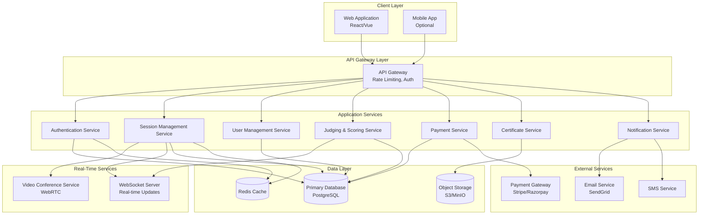
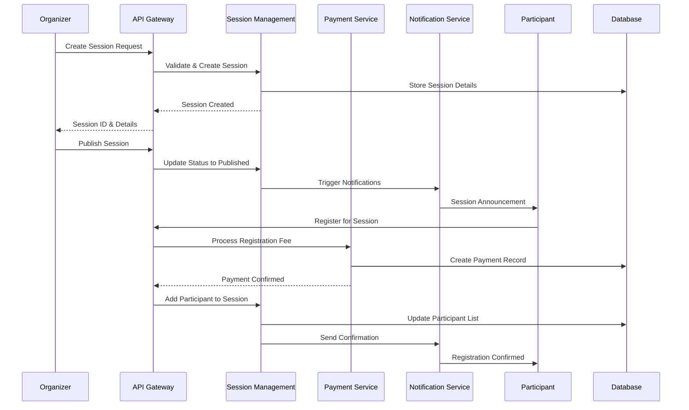
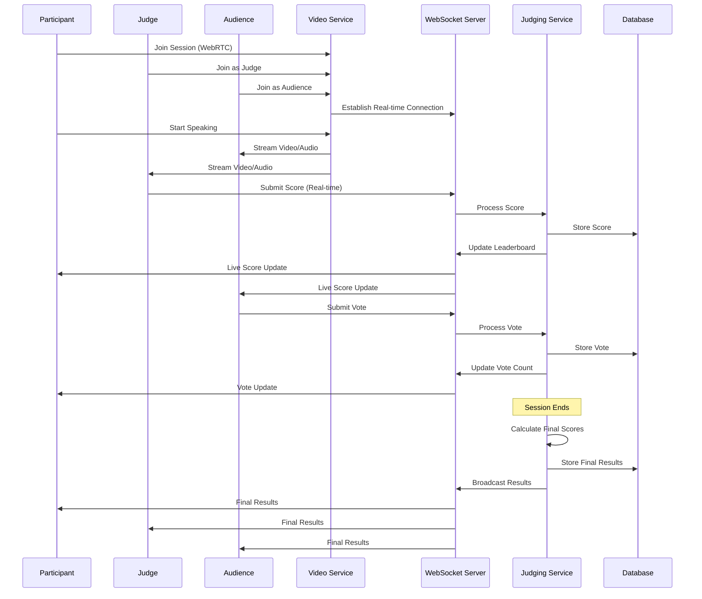
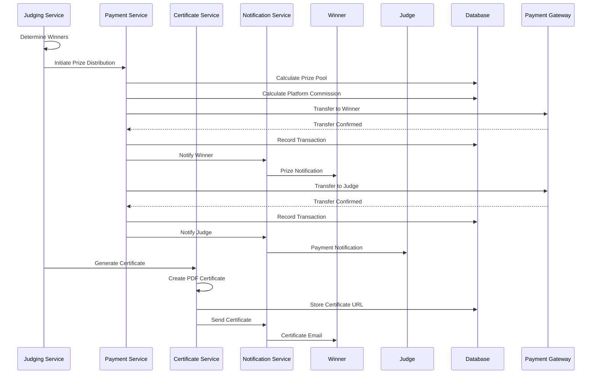

# Design Document: Debate and Discussion Platform

## Overview

The Debate and Discussion Platform is a comprehensive online system designed to facilitate skill development through structured competitive sessions including debates, group discussions, webinars, and seminars. The platform connects participants (students and professionals) with judges and audiences, providing a complete ecosystem for conducting sessions with transparent scoring, real-time interaction, and reward distribution. The system handles multiple concurrent live sessions with video conferencing, real-time judging, audience voting, payment processing, and automated certificate generation.

The platform addresses the critical gap in soft skill development by providing accessible opportunities for practice and competition. It implements a multi-sided marketplace model where participants pay to compete, audiences pay to learn, judges earn income, and organizers manage sessions. The architecture supports individual organizers and organizational modules for internal and inter-organizational competitions.

## Architecture



## Sequence Diagrams

### Session Creation and Registration Flow



### Live Session Execution Flow



### Prize Distribution Flow



## Components and Interfaces

### Component 1: Authentication Service

**Purpose**: Manages user authentication, authorization, and role-based access control for all user types (participants, judges, audience, organizers).

**Interface**:
```typescript
interface AuthenticationService {
  register(userData: UserRegistrationData): Promise<AuthResult>
  login(credentials: LoginCredentials): Promise<AuthResult>
  logout(userId: string): Promise<void>
  refreshToken(refreshToken: string): Promise<TokenPair>
  verifyToken(token: string): Promise<TokenPayload>
  assignRole(userId: string, role: UserRole): Promise<void>
  revokeRole(userId: string, role: UserRole): Promise<void>
}

interface UserRegistrationData {
  email: string
  password: string
  fullName: string
  userType: UserRole
  organizationId?: string
}

interface LoginCredentials {
  email: string
  password: string
}

interface AuthResult {
  success: boolean
  user?: User
  tokens?: TokenPair
  error?: string
}

interface TokenPair {
  accessToken: string
  refreshToken: string
  expiresIn: number
}

enum UserRole {
  PARTICIPANT = "participant",
  JUDGE = "judge",
  AUDIENCE = "audience",
  ORGANIZER = "organizer",
  ORG_ADMIN = "org_admin"
}
```

**Responsibilities**:
- User registration with email verification
- Secure password hashing and storage
- JWT token generation and validation
- Role-based access control (RBAC)
- Session management
- Multi-factor authentication (optional)


### Component 2: Session Management Service

**Purpose**: Handles creation, scheduling, lifecycle management, and execution of all session types (debates, group discussions, webinars, seminars).

**Interface**:
```typescript
interface SessionManagementService {
  createSession(sessionData: SessionCreationData): Promise<Session>
  updateSession(sessionId: string, updates: Partial<Session>): Promise<Session>
  deleteSession(sessionId: string): Promise<void>
  publishSession(sessionId: string): Promise<void>
  getSession(sessionId: string): Promise<Session>
  listSessions(filters: SessionFilters): Promise<PaginatedResult<Session>>
  registerParticipant(sessionId: string, userId: string, paymentId: string): Promise<Registration>
  registerAudience(sessionId: string, userId: string, paymentId: string): Promise<Registration>
  assignJudge(sessionId: string, judgeId: string): Promise<void>
  startSession(sessionId: string): Promise<SessionState>
  endSession(sessionId: string): Promise<SessionResult>
  getSessionState(sessionId: string): Promise<SessionState>
}

interface SessionCreationData {
  title: string
  description: string
  sessionType: SessionType
  format: SessionFormat
  scheduledAt: Date
  duration: number
  organizerId: string
  organizationType: OrganizationType
  maxParticipants: number
  maxAudience: number
  requiredJudges: number
  participantFee: number
  audienceFee: number
  judgeFee: number
  prizePool: PrizeDistribution
  rules: string
  topics?: string[]
}

enum SessionType {
  DEBATE = "debate",
  GROUP_DISCUSSION = "group_discussion",
  WEBINAR = "webinar",
  SEMINAR = "seminar"
}

enum SessionFormat {
  ONE_V_ONE = "1v1",
  TWO_V_TWO = "2v2",
  FOUR_V_FOUR = "4v4",
  GROUP = "group",
  PANEL = "panel"
}

enum OrganizationType {
  INDIVIDUAL = "individual",
  ORGANIZATION_INTERNAL = "organization_internal",
  ORGANIZATION_INTER = "organization_inter"
}

interface Session {
  id: string
  title: string
  description: string
  sessionType: SessionType
  format: SessionFormat
  scheduledAt: Date
  duration: number
  status: SessionStatus
  organizerId: string
  organizationType: OrganizationType
  participants: string[]
  judges: string[]
  audience: string[]
  maxParticipants: number
  maxAudience: number
  participantFee: number
  audienceFee: number
  judgeFee: number
  prizePool: PrizeDistribution
  createdAt: Date
  updatedAt: Date
}

enum SessionStatus {
  DRAFT = "draft",
  PUBLISHED = "published",
  REGISTRATION_OPEN = "registration_open",
  REGISTRATION_CLOSED = "registration_closed",
  IN_PROGRESS = "in_progress",
  COMPLETED = "completed",
  CANCELLED = "cancelled"
}
```

**Responsibilities**:
- Session CRUD operations
- Session lifecycle state management
- Participant and audience registration
- Judge assignment and validation
- Capacity management
- Session scheduling and conflict detection
