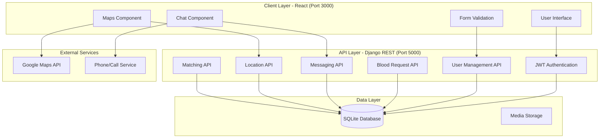
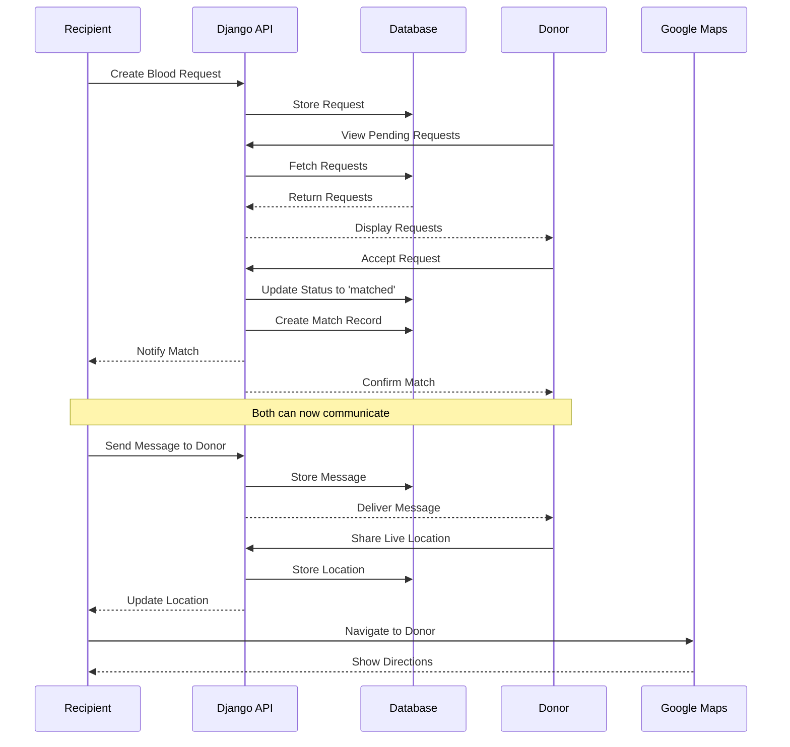

# Design Document: Enhanced Blood Donation Platform

## Overview

This design enhances the existing blood donation platform by transforming it from a role-based system (separate donors/recipients) into a unified user system where every user can both request and donate blood. The enhancement adds real-time communication features (messaging and calling), live location sharing with Google Maps integration, and comprehensive form validation. The design maintains the existing Django REST Framework backend with JWT authentication and React frontend while adding new models, API endpoints, and UI components to support bidirectional interactions between users.

## Architecture

### System Architecture Overview



### Communication Flow



## Components and Interfaces

### Backend Components

#### 1. User Management Component

**Purpose**: Manages unified user accounts with dual capabilities (donor and recipient)

**Interface**:
```python
class User(AbstractUser):
    # Existing fields
    blood_type: CharField(max_length=3, choices=BLOOD_CHOICES)
    phone: CharField(max_length=10)  # Validated to exactly 10 digits
    email: EmailField()  # Validated format
    city: CharField(max_length=128)
    age: IntegerField(validators=[MinValueValidator(18)])
    weight: FloatField()
    verified: BooleanField(default=False)
    
    # New fields for unified system
    is_available_to_donate: BooleanField(default=True)
    last_donation_date: DateField(null=True, blank=True)
    current_latitude: FloatField(null=True, blank=True)
    current_longitude: FloatField(null=True, blank=True)
    location_sharing_enabled: BooleanField(default=False)
    location_updated_at: DateTimeField(null=True, blank=True)
    
    def can_donate(self) -> bool:
        """Check if user is eligible to donate (90 days since last donation)"""
        pass
    
    def update_location(self, latitude: float, longitude: float) -> None:
        """Update user's current location"""
        pass
```

**Responsibilities**:
- Validate phone numbers (exactly 10 digits)
- Validate email format
- Track donation eligibility
- Manage location data
- Handle user profile updates

**Validation Rules**:
- Phone: Must be exactly 10 digits, numeric only
- Email: Must match pattern `^[a-zA-Z0-9._%+-]+@[a-zA-Z0-9.-]+\.[a-zA-Z]{2,}$`
- Age: Minimum 18 years
- Weight: Minimum 50 kg
- Blood Type: Must be one of: O+, O-, A+, A-, B+, B-, AB+, AB-

#### 2. Blood Request Component

**Purpose**: Manages blood requests with matching and status tracking

**Interface**:
```python
class BloodRequest(models.Model):
    STATUS_CHOICES = [
        ('pending', 'Pending'),
        ('matched', 'Matched'),
        ('completed', 'Completed'),
        ('cancelled', 'Cancelled')
    ]
    
    requester: ForeignKey(User, related_name='blood_requests')
    blood_type: CharField(max_length=3)
    quantity: IntegerField(default=1)
    urgency: CharField(max_length=64)
    reason: TextField()
    hospital: CharField(max_length=256)
    city: CharField(max_length=128)
    phone: CharField(max_length=10)
    latitude: FloatField()
    longitude: FloatField()
    status: CharField(max_length=32, choices=STATUS_CHOICES)
    created_at: DateTimeField(auto_now_add=True)
    completed_at: DateTimeField(null=True, blank=True)
    
    def get_compatible_donors(self) -> QuerySet:
        """Find donors with compatible blood types"""
        pass
```

**Responsibilities**:
- Create and manage blood requests
- Track request status
- Find compatible donors
- Store location data for navigation

#### 3. Matching Component

**Purpose**: Connects donors with recipients and manages the matching lifecycle

**Interface**:
```python
class DonorMatch(models.Model):
    request: ForeignKey(BloodRequest, related_name='matches')
    donor: ForeignKey(User, related_name='donations')
    matched_at: DateTimeField(auto_now_add=True)
    status: CharField(max_length=32)  # 'active', 'completed', 'cancelled'
    completed_at: DateTimeField(null=True, blank=True)
    rating: IntegerField(null=True, blank=True)  # 1-5 stars
    feedback: TextField(blank=True)
    
    def complete_donation(self) -> None:
        """Mark donation as completed and update user's last_donation_date"""
        pass
    
    def cancel_match(self, reason: str) -> None:
        """Cancel the match and make request available again"""
        pass
```

**Responsibilities**:
- Create matches between donors and recipients
- Track match lifecycle
- Enable both parties to see each other's contact info
- Record donation completion
- Handle match cancellations


#### 4. Messaging Component

**Purpose**: Enables real-time text communication between matched users

**Interface**:
```python
class Message(models.Model):
    match: ForeignKey(DonorMatch, related_name='messages')
    sender: ForeignKey(User, related_name='sent_messages')
    receiver: ForeignKey(User, related_name='received_messages')
    content: TextField()
    sent_at: DateTimeField(auto_now_add=True)
    read_at: DateTimeField(null=True, blank=True)
    is_read: BooleanField(default=False)
    
    def mark_as_read(self) -> None:
        """Mark message as read and set read_at timestamp"""
        pass
    
    class Meta:
        ordering = ['sent_at']
```

**Responsibilities**:
- Store messages between matched users
- Track read/unread status
- Maintain message history
- Support real-time message delivery

#### 5. Location Sharing Component

**Purpose**: Manages live location sharing between matched users

**Interface**:
```python
class LocationShare(models.Model):
    match: ForeignKey(DonorMatch, related_name='location_shares')
    user: ForeignKey(User, related_name='shared_locations')
    latitude: FloatField()
    longitude: FloatField()
    shared_at: DateTimeField(auto_now_add=True)
    expires_at: DateTimeField()  # Location share expires after certain time
    is_active: BooleanField(default=True)
    
    def is_expired(self) -> bool:
        """Check if location share has expired"""
        pass
    
    def deactivate(self) -> None:
        """Stop sharing location"""
        pass
```

**Responsibilities**:
- Store and update live location data
- Manage location sharing permissions
- Handle location expiration
- Provide location data for navigation


### Frontend Components

#### 1. Unified Dashboard Component

**Purpose**: Single dashboard for all users showing both donation opportunities and active requests

**Interface**:
```typescript
interface DashboardProps {
  user: User;
}

interface DashboardState {
  activeRequests: BloodRequest[];
  availableRequests: BloodRequest[];
  activeMatches: DonorMatch[];
  view: 'donor' | 'recipient';
}

function UnifiedDashboard(props: DashboardProps): JSX.Element
```

**Responsibilities**:
- Display user's active blood requests
- Show available donation opportunities
- Toggle between donor and recipient views
- Navigate to messaging and location features

#### 2. Chat Component

**Purpose**: Real-time messaging interface between matched users

**Interface**:
```typescript
interface ChatProps {
  match: DonorMatch;
  currentUser: User;
  otherUser: User;
}

interface Message {
  id: number;
  sender: User;
  content: string;
  sentAt: Date;
  isRead: boolean;
}

function ChatInterface(props: ChatProps): JSX.Element
```

**Responsibilities**:
- Display message history
- Send new messages
- Show read/unread status
- Auto-scroll to latest messages
- Real-time message updates


#### 3. Location Sharing Component

**Purpose**: Display and share live location with Google Maps integration

**Interface**:
```typescript
interface LocationShareProps {
  match: DonorMatch;
  currentUser: User;
  otherUser: User;
}

interface LocationData {
  latitude: number;
  longitude: number;
  timestamp: Date;
  isActive: boolean;
}

function LocationShare(props: LocationShareProps): JSX.Element
```

**Responsibilities**:
- Display Google Maps with user locations
- Enable/disable location sharing
- Update location in real-time
- Provide "Navigate to location" button
- Calculate distance between users
- Open Google Maps app for navigation

#### 4. Form Validation Component

**Purpose**: Reusable form validation for phone and email inputs

**Interface**:
```typescript
interface ValidationResult {
  isValid: boolean;
  error: string | null;
}

function validatePhone(phone: string): ValidationResult
function validateEmail(email: string): ValidationResult

interface ValidatedInputProps {
  type: 'phone' | 'email';
  value: string;
  onChange: (value: string) => void;
  onValidation: (result: ValidationResult) => void;
}

function ValidatedInput(props: ValidatedInputProps): JSX.Element
```

**Responsibilities**:
- Validate phone numbers (exactly 10 digits)
- Validate email format
- Show real-time validation feedback
- Display error messages
- Prevent form submission with invalid data


#### 5. Contact Actions Component

**Purpose**: Provides messaging and calling actions for matched users

**Interface**:
```typescript
interface ContactActionsProps {
  match: DonorMatch;
  otherUser: User;
  onMessage: () => void;
  onCall: () => void;
  onShareLocation: () => void;
}

function ContactActions(props: ContactActionsProps): JSX.Element
```

**Responsibilities**:
- Display contact information after match
- Provide message button
- Provide call button (click-to-call)
- Provide location sharing toggle
- Show contact availability status

## Data Models

### Enhanced User Model

```python
class User(AbstractUser):
    # Authentication & Identity
    username = models.CharField(max_length=150, unique=True)
    email = models.EmailField(unique=True)
    first_name = models.CharField(max_length=150)
    last_name = models.CharField(max_length=150)
    
    # Blood Donation Profile
    blood_type = models.CharField(
        max_length=3,
        choices=[('O+','O+'),('O-','O-'),('A+','A+'),('A-','A-'),
                 ('B+','B+'),('B-','B-'),('AB+','AB+'),('AB-','AB-')],
        null=True, blank=True
    )
    phone = models.CharField(max_length=10)  # Exactly 10 digits
    city = models.CharField(max_length=128)
    age = models.IntegerField(validators=[MinValueValidator(18)])
    weight = models.FloatField(validators=[MinValueValidator(50)])
    verified = models.BooleanField(default=False)
    
    # Unified System Fields
    is_available_to_donate = models.BooleanField(default=True)
    last_donation_date = models.DateField(null=True, blank=True)
    
    # Location Fields
    current_latitude = models.FloatField(null=True, blank=True)
    current_longitude = models.FloatField(null=True, blank=True)
    location_sharing_enabled = models.BooleanField(default=False)
    location_updated_at = models.DateTimeField(null=True, blank=True)
    
    # Metadata
    created_at = models.DateTimeField(auto_now_add=True)
    updated_at = models.DateTimeField(auto_now=True)
```


**Validation Rules**:
- Phone: Regex `^\d{10}$` (exactly 10 digits)
- Email: Django EmailValidator
- Age: Minimum 18
- Weight: Minimum 50 kg
- Blood Type: Must be in choices list

### DonorMatch Model

```python
class DonorMatch(models.Model):
    STATUS_CHOICES = [
        ('active', 'Active'),
        ('completed', 'Completed'),
        ('cancelled', 'Cancelled')
    ]
    
    request = models.ForeignKey(
        'BloodRequest',
        related_name='matches',
        on_delete=models.CASCADE
    )
    donor = models.ForeignKey(
        User,
        related_name='donations',
        on_delete=models.CASCADE
    )
    status = models.CharField(
        max_length=32,
        choices=STATUS_CHOICES,
        default='active'
    )
    matched_at = models.DateTimeField(auto_now_add=True)
    completed_at = models.DateTimeField(null=True, blank=True)
    
    # Feedback
    rating = models.IntegerField(
        null=True,
        blank=True,
        validators=[MinValueValidator(1), MaxValueValidator(5)]
    )
    feedback = models.TextField(blank=True)
    
    class Meta:
        unique_together = ['request', 'donor']
        ordering = ['-matched_at']
```

### Message Model

```python
class Message(models.Model):
    match = models.ForeignKey(
        DonorMatch,
        related_name='messages',
        on_delete=models.CASCADE
    )
    sender = models.ForeignKey(
        User,
        related_name='sent_messages',
        on_delete=models.CASCADE
    )
    receiver = models.ForeignKey(
        User,
        related_name='received_messages',
        on_delete=models.CASCADE
    )
    content = models.TextField()
    sent_at = models.DateTimeField(auto_now_add=True)
    read_at = models.DateTimeField(null=True, blank=True)
    is_read = models.BooleanField(default=False)
    
    class Meta:
        ordering = ['sent_at']
        indexes = [
            models.Index(fields=['match', 'sent_at']),
            models.Index(fields=['receiver', 'is_read'])
        ]
```


### LocationShare Model

```python
class LocationShare(models.Model):
    match = models.ForeignKey(
        DonorMatch,
        related_name='location_shares',
        on_delete=models.CASCADE
    )
    user = models.ForeignKey(
        User,
        related_name='shared_locations',
        on_delete=models.CASCADE
    )
    latitude = models.FloatField()
    longitude = models.FloatField()
    shared_at = models.DateTimeField(auto_now_add=True)
    expires_at = models.DateTimeField()
    is_active = models.BooleanField(default=True)
    
    class Meta:
        ordering = ['-shared_at']
        indexes = [
            models.Index(fields=['match', 'user', 'is_active'])
        ]
```

## Algorithmic Pseudocode

### Algorithm 1: Match Donor with Blood Request

```pascal
ALGORITHM matchDonorWithRequest(donor_id, request_id)
INPUT: donor_id (integer), request_id (integer)
OUTPUT: match (DonorMatch object) or error

PRECONDITIONS:
  - donor_id exists in User table
  - request_id exists in BloodRequest table
  - request.status = 'pending'
  - donor.blood_type is compatible with request.blood_type
  - donor.is_available_to_donate = true
  - donor.can_donate() = true (90 days since last donation)

BEGIN
  // Step 1: Validate donor and request
  donor ← User.objects.get(id=donor_id)
  request ← BloodRequest.objects.get(id=request_id)
  
  IF request.status ≠ 'pending' THEN
    RETURN Error("Request is not available")
  END IF
  
  IF NOT isCompatibleBloodType(donor.blood_type, request.blood_type) THEN
    RETURN Error("Blood type not compatible")
  END IF
  
  IF NOT donor.can_donate() THEN
    RETURN Error("Donor not eligible (must wait 90 days)")
  END IF
  
  // Step 2: Create match with transaction
  BEGIN TRANSACTION
    match ← DonorMatch.create(
      request=request,
      donor=donor,
      status='active'
    )
    
    request.status ← 'matched'
    request.save()
    
    // Step 3: Enable contact visibility
    createContactPermission(donor, request.requester)
    createContactPermission(request.requester, donor)
  COMMIT TRANSACTION
  
  // Step 4: Send notifications
  notifyUser(request.requester, "Donor found for your request")
  notifyUser(donor, "You matched with a blood request")
  
  RETURN match
END

POSTCONDITIONS:
  - match exists in DonorMatch table
  - match.status = 'active'
  - request.status = 'matched'
  - Both users can see each other's contact info
  - Both users receive notifications
```


### Algorithm 2: Send Message Between Matched Users

```pascal
ALGORITHM sendMessage(sender_id, receiver_id, match_id, content)
INPUT: sender_id, receiver_id, match_id (integers), content (string)
OUTPUT: message (Message object) or error

PRECONDITIONS:
  - sender_id and receiver_id exist in User table
  - match_id exists in DonorMatch table
  - match.status = 'active'
  - sender is either match.donor or match.request.requester
  - receiver is either match.donor or match.request.requester
  - sender ≠ receiver
  - content is not empty

BEGIN
  // Step 1: Validate match and participants
  match ← DonorMatch.objects.get(id=match_id)
  sender ← User.objects.get(id=sender_id)
  receiver ← User.objects.get(id=receiver_id)
  
  IF match.status ≠ 'active' THEN
    RETURN Error("Match is not active")
  END IF
  
  IF NOT isParticipant(sender, match) OR NOT isParticipant(receiver, match) THEN
    RETURN Error("Users are not part of this match")
  END IF
  
  IF content.trim() = "" THEN
    RETURN Error("Message content cannot be empty")
  END IF
  
  // Step 2: Create and save message
  message ← Message.create(
    match=match,
    sender=sender,
    receiver=receiver,
    content=content.trim(),
    is_read=false
  )
  
  // Step 3: Send real-time notification
  sendPushNotification(receiver, {
    title: sender.first_name + " sent you a message",
    body: content.substring(0, 50),
    data: {match_id: match_id, message_id: message.id}
  })
  
  RETURN message
END

POSTCONDITIONS:
  - message exists in Message table
  - message.is_read = false
  - receiver receives push notification
  - message appears in chat interface
```


### Algorithm 3: Share Live Location

```pascal
ALGORITHM shareLocation(user_id, match_id, latitude, longitude)
INPUT: user_id, match_id (integers), latitude, longitude (floats)
OUTPUT: location_share (LocationShare object) or error

PRECONDITIONS:
  - user_id exists in User table
  - match_id exists in DonorMatch table
  - match.status = 'active'
  - user is participant in match
  - -90 ≤ latitude ≤ 90
  - -180 ≤ longitude ≤ 180
  - user.location_sharing_enabled = true

BEGIN
  // Step 1: Validate inputs
  user ← User.objects.get(id=user_id)
  match ← DonorMatch.objects.get(id=match_id)
  
  IF match.status ≠ 'active' THEN
    RETURN Error("Match is not active")
  END IF
  
  IF NOT isParticipant(user, match) THEN
    RETURN Error("User is not part of this match")
  END IF
  
  IF NOT user.location_sharing_enabled THEN
    RETURN Error("Location sharing is disabled")
  END IF
  
  IF NOT isValidCoordinate(latitude, longitude) THEN
    RETURN Error("Invalid coordinates")
  END IF
  
  // Step 2: Deactivate previous location shares
  LocationShare.objects.filter(
    match=match,
    user=user,
    is_active=true
  ).update(is_active=false)
  
  // Step 3: Create new location share
  expires_at ← now() + 4 hours
  location_share ← LocationShare.create(
    match=match,
    user=user,
    latitude=latitude,
    longitude=longitude,
    expires_at=expires_at,
    is_active=true
  )
  
  // Step 4: Update user's current location
  user.current_latitude ← latitude
  user.current_longitude ← longitude
  user.location_updated_at ← now()
  user.save()
  
  // Step 5: Notify other participant
  other_user ← getOtherParticipant(match, user)
  sendRealtimeUpdate(other_user, {
    type: "location_update",
    match_id: match_id,
    user_id: user_id,
    latitude: latitude,
    longitude: longitude
  })
  
  RETURN location_share
END

POSTCONDITIONS:
  - location_share exists and is_active = true
  - Previous location shares for same user/match are deactivated
  - user.current_latitude and current_longitude are updated
  - Other participant receives real-time location update
  - Location expires after 4 hours
```


### Algorithm 4: Validate Form Input

```pascal
ALGORITHM validateFormInput(field_type, value)
INPUT: field_type (string), value (string)
OUTPUT: validation_result (object with isValid and error)

PRECONDITIONS:
  - field_type is one of: 'phone', 'email', 'age', 'weight', 'blood_type'
  - value is a string

BEGIN
  result ← {isValid: false, error: null}
  
  CASE field_type OF
    'phone':
      // Must be exactly 10 digits
      IF NOT matches(value, "^\d{10}$") THEN
        result.error ← "Phone number must be exactly 10 digits"
      ELSE
        result.isValid ← true
      END IF
    
    'email':
      // Must match email pattern
      pattern ← "^[a-zA-Z0-9._%+-]+@[a-zA-Z0-9.-]+\.[a-zA-Z]{2,}$"
      IF NOT matches(value, pattern) THEN
        result.error ← "Please enter a valid email address"
      ELSE
        result.isValid ← true
      END IF
    
    'age':
      age ← parseInt(value)
      IF isNaN(age) OR age < 18 THEN
        result.error ← "Age must be at least 18 years"
      ELSE IF age > 120 THEN
        result.error ← "Please enter a valid age"
      ELSE
        result.isValid ← true
      END IF
    
    'weight':
      weight ← parseFloat(value)
      IF isNaN(weight) OR weight < 50 THEN
        result.error ← "Weight must be at least 50 kg"
      ELSE IF weight > 300 THEN
        result.error ← "Please enter a valid weight"
      ELSE
        result.isValid ← true
      END IF
    
    'blood_type':
      valid_types ← ['O+', 'O-', 'A+', 'A-', 'B+', 'B-', 'AB+', 'AB-']
      IF value NOT IN valid_types THEN
        result.error ← "Please select a valid blood type"
      ELSE
        result.isValid ← true
      END IF
    
    DEFAULT:
      result.error ← "Unknown field type"
  END CASE
  
  RETURN result
END

POSTCONDITIONS:
  - result.isValid = true if validation passes
  - result.error contains descriptive message if validation fails
  - No side effects on input data
```


### Algorithm 5: Calculate Distance Between Users

```pascal
ALGORITHM calculateDistance(lat1, lon1, lat2, lon2)
INPUT: lat1, lon1, lat2, lon2 (floats representing coordinates)
OUTPUT: distance in kilometers (float)

PRECONDITIONS:
  - -90 ≤ lat1, lat2 ≤ 90
  - -180 ≤ lon1, lon2 ≤ 180

BEGIN
  // Haversine formula for calculating distance between two points on Earth
  R ← 6371  // Earth's radius in kilometers
  
  // Convert degrees to radians
  φ1 ← lat1 × π / 180
  φ2 ← lat2 × π / 180
  Δφ ← (lat2 - lat1) × π / 180
  Δλ ← (lon2 - lon1) × π / 180
  
  // Haversine formula
  a ← sin²(Δφ/2) + cos(φ1) × cos(φ2) × sin²(Δλ/2)
  c ← 2 × atan2(√a, √(1-a))
  distance ← R × c
  
  RETURN distance
END

POSTCONDITIONS:
  - distance ≥ 0
  - distance represents great-circle distance in kilometers
```

## Key Functions with Formal Specifications

### Function 1: User.can_donate()

```python
def can_donate(self) -> bool:
    """Check if user is eligible to donate blood"""
    pass
```

**Preconditions:**
- User object exists and is saved to database
- User has blood_type set

**Postconditions:**
- Returns True if user can donate (no donation in last 90 days or never donated)
- Returns False if user donated within last 90 days
- No side effects on user object

**Loop Invariants:** N/A (no loops)

### Function 2: BloodRequest.get_compatible_donors()

```python
def get_compatible_donors(self) -> QuerySet:
    """Find all donors with compatible blood types"""
    pass
```

**Preconditions:**
- BloodRequest object exists with valid blood_type
- blood_type is one of: O+, O-, A+, A-, B+, B-, AB+, AB-

**Postconditions:**
- Returns QuerySet of User objects with compatible blood types
- Donors are filtered by: is_available_to_donate=True, can_donate()=True
- Results ordered by distance if location available
- Empty QuerySet if no compatible donors found

**Loop Invariants:** N/A (database query)


### Function 3: Message.mark_as_read()

```python
def mark_as_read(self) -> None:
    """Mark message as read and set timestamp"""
    pass
```

**Preconditions:**
- Message object exists in database
- is_read is False
- read_at is None

**Postconditions:**
- is_read is set to True
- read_at is set to current timestamp
- Changes are persisted to database
- No other fields are modified

**Loop Invariants:** N/A (no loops)

### Function 4: LocationShare.is_expired()

```python
def is_expired(self) -> bool:
    """Check if location share has expired"""
    pass
```

**Preconditions:**
- LocationShare object exists
- expires_at is set to valid datetime

**Postconditions:**
- Returns True if current time > expires_at
- Returns False if current time ≤ expires_at
- No side effects on object

**Loop Invariants:** N/A (no loops)

### Function 5: DonorMatch.complete_donation()

```python
def complete_donation(self) -> None:
    """Mark donation as completed and update donor's last donation date"""
    pass
```

**Preconditions:**
- DonorMatch object exists with status='active'
- donor and request are valid foreign keys
- completed_at is None

**Postconditions:**
- status is set to 'completed'
- completed_at is set to current timestamp
- donor.last_donation_date is set to current date
- request.status is set to 'completed'
- All changes are persisted in transaction
- Both users receive completion notification

**Loop Invariants:** N/A (no loops)


## Example Usage

### Example 1: User Registration with Validation

```python
# Frontend validation
phone = "1234567890"
email = "user@example.com"

phone_validation = validateFormInput('phone', phone)
if not phone_validation['isValid']:
    show_error(phone_validation['error'])
    return

email_validation = validateFormInput('email', email)
if not email_validation['isValid']:
    show_error(email_validation['error'])
    return

# Backend registration
user_data = {
    'email': email,
    'password': 'securepass123',
    'phone': phone,
    'blood_type': 'O+',
    'age': 25,
    'weight': 70,
    'city': 'Mumbai'
}

response = await authAPI.register(user_data)
if response.data.success:
    localStorage.setItem('token', response.data.token)
    navigate('/dashboard')
```

### Example 2: Donor Accepts Request and Initiates Contact

```python
# Donor views pending requests
requests = await requestAPI.getPendingRequests()

# Donor accepts a request
selected_request = requests[0]
match = await matchDonorWithRequest(donor.id, selected_request.id)

# Both users can now see contact info
recipient_info = match.request.requester
donor_info = match.donor

# Donor sends first message
message = await sendMessage(
    sender_id=donor.id,
    receiver_id=recipient_info.id,
    match_id=match.id,
    content="Hi, I can donate blood. When should I come?"
)

# Recipient receives notification and replies
reply = await sendMessage(
    sender_id=recipient_info.id,
    receiver_id=donor.id,
    match_id=match.id,
    content="Thank you! Can you come to City Hospital tomorrow at 10 AM?"
)
```

### Example 3: Location Sharing and Navigation

```python
# Donor enables location sharing
donor.location_sharing_enabled = True
donor.save()

# Donor shares current location
location = await shareLocation(
    user_id=donor.id,
    match_id=match.id,
    latitude=19.0760,
    longitude=72.8777
)

# Recipient views donor's location on map
donor_location = await getActiveLocation(match.id, donor.id)
distance = calculateDistance(
    recipient.current_latitude,
    recipient.current_longitude,
    donor_location.latitude,
    donor_location.longitude
)
console.log(`Donor is ${distance.toFixed(2)} km away`)

# Recipient clicks "Navigate to location"
maps_url = `https://www.google.com/maps/dir/?api=1&destination=${donor_location.latitude},${donor_location.longitude}`
window.open(maps_url, '_blank')
```


### Example 4: Complete Donation Flow

```python
# After successful donation
await match.complete_donation()

# System updates:
# - match.status = 'completed'
# - match.completed_at = now()
# - donor.last_donation_date = today()
# - request.status = 'completed'

# Recipient can leave feedback
await submitFeedback(
    match_id=match.id,
    rating=5,
    feedback="Very helpful donor, arrived on time!"
)

# Both users receive completion notification
notifyUser(donor, "Thank you for donating blood!")
notifyUser(recipient, "Donation completed successfully")
```

## Correctness Properties

### Property 1: Phone Number Validation
**Universal Quantification**: ∀ phone ∈ String, validateFormInput('phone', phone).isValid = true ⟺ phone matches /^\d{10}$/

### Property 2: Email Validation
**Universal Quantification**: ∀ email ∈ String, validateFormInput('email', email).isValid = true ⟺ email matches /^[a-zA-Z0-9._%+-]+@[a-zA-Z0-9.-]+\.[a-zA-Z]{2,}$/

### Property 3: Match Uniqueness
**Universal Quantification**: ∀ donor ∈ User, ∀ request ∈ BloodRequest, ∃ at most one match ∈ DonorMatch where match.donor = donor ∧ match.request = request

### Property 4: Message Ordering
**Universal Quantification**: ∀ match ∈ DonorMatch, ∀ m1, m2 ∈ match.messages, m1.sent_at < m2.sent_at ⟹ m1 appears before m2 in chat interface

### Property 5: Location Expiration
**Universal Quantification**: ∀ location ∈ LocationShare, location.is_expired() = true ⟺ now() > location.expires_at

### Property 6: Donation Eligibility
**Universal Quantification**: ∀ user ∈ User, user.can_donate() = true ⟺ (user.last_donation_date = null ∨ (today() - user.last_donation_date) ≥ 90 days)

### Property 7: Blood Type Compatibility
**Universal Quantification**: ∀ request ∈ BloodRequest, ∀ donor ∈ request.get_compatible_donors(), isCompatibleBloodType(donor.blood_type, request.blood_type) = true

### Property 8: Match Participant Validation
**Universal Quantification**: ∀ match ∈ DonorMatch, ∀ message ∈ match.messages, (message.sender = match.donor ∨ message.sender = match.request.requester) ∧ (message.receiver = match.donor ∨ message.receiver = match.request.requester)

### Property 9: Contact Visibility After Match
**Universal Quantification**: ∀ match ∈ DonorMatch where match.status = 'active', match.donor can view match.request.requester.phone ∧ match.request.requester can view match.donor.phone

### Property 10: Location Share Deactivation
**Universal Quantification**: ∀ user ∈ User, ∀ match ∈ DonorMatch, when new LocationShare is created for (user, match), all previous LocationShare objects for (user, match) have is_active = false


## Error Handling

### Error Scenario 1: Invalid Phone Number

**Condition**: User enters phone number that is not exactly 10 digits
**Response**: 
- Frontend displays error message: "Phone number must be exactly 10 digits"
- Form submission is blocked
- Input field is highlighted in red
**Recovery**: User corrects phone number to match validation pattern

### Error Scenario 2: Invalid Email Format

**Condition**: User enters email that doesn't match valid email pattern
**Response**:
- Frontend displays error message: "Please enter a valid email address"
- Form submission is blocked
- Input field is highlighted in red
**Recovery**: User corrects email format

### Error Scenario 3: Match Already Exists

**Condition**: Donor tries to accept a request they've already matched with
**Response**:
- Backend returns 400 error: "You have already matched with this request"
- Frontend displays error notification
**Recovery**: User is redirected to their active matches

### Error Scenario 4: Request No Longer Available

**Condition**: Donor tries to accept a request that was already matched by another donor
**Response**:
- Backend returns 409 error: "This request has already been matched"
- Frontend removes request from available list
- User sees notification: "This request is no longer available"
**Recovery**: User can browse other available requests

### Error Scenario 5: Location Sharing Disabled

**Condition**: User tries to share location but has location_sharing_enabled = false
**Response**:
- Backend returns 403 error: "Location sharing is disabled"
- Frontend prompts user to enable location sharing
**Recovery**: User enables location sharing in settings, then tries again

### Error Scenario 6: Message to Non-Matched User

**Condition**: User tries to send message to someone they're not matched with
**Response**:
- Backend returns 403 error: "You can only message matched users"
- Frontend prevents message sending
**Recovery**: User can only message users they have active matches with

### Error Scenario 7: Expired Location Share

**Condition**: User tries to view location that has expired (>4 hours old)
**Response**:
- Frontend displays: "Location share has expired"
- Map shows last known location with "expired" indicator
**Recovery**: User can request fresh location share from other participant

### Error Scenario 8: Donation Too Soon

**Condition**: User tries to accept request but donated within last 90 days
**Response**:
- Backend returns 403 error: "You must wait 90 days between donations"
- Frontend displays days remaining until eligible
**Recovery**: User waits until eligible or system suggests alternative donors


### Error Scenario 9: Network Failure During Message Send

**Condition**: Network connection lost while sending message
**Response**:
- Frontend queues message locally
- Shows "sending..." indicator
- Retries automatically when connection restored
**Recovery**: Message is sent when network is available, or user can manually retry

### Error Scenario 10: GPS/Location Permission Denied

**Condition**: User denies browser location permission
**Response**:
- Frontend displays: "Location permission required for this feature"
- Shows instructions to enable location in browser settings
**Recovery**: User grants location permission and refreshes page

## Testing Strategy

### Unit Testing Approach

**Backend Unit Tests (Django)**:
- Test each model's validation rules (phone, email, age, weight)
- Test User.can_donate() with various last_donation_date values
- Test BloodRequest.get_compatible_donors() with different blood types
- Test Message.mark_as_read() state changes
- Test LocationShare.is_expired() with different timestamps
- Test DonorMatch.complete_donation() transaction integrity

**Frontend Unit Tests (React/Jest)**:
- Test validateFormInput() for all field types
- Test phone validation with valid/invalid inputs
- Test email validation with edge cases
- Test calculateDistance() with known coordinates
- Test chat message rendering and ordering
- Test location map component with mock data

**Test Coverage Goals**: Minimum 80% code coverage for critical paths

### Property-Based Testing Approach

**Property Test Library**: Hypothesis (Python backend), fast-check (JavaScript frontend)

**Backend Property Tests**:
1. Phone validation: Generate random strings, verify only 10-digit strings pass
2. Email validation: Generate random emails, verify format compliance
3. Blood type compatibility: Generate all blood type combinations, verify compatibility matrix
4. Distance calculation: Generate random coordinates, verify distance is always non-negative
5. Message ordering: Generate random message sequences, verify chronological ordering
6. Location expiration: Generate random timestamps, verify expiration logic

**Frontend Property Tests**:
1. Form validation consistency: Same input always produces same validation result
2. Distance calculation symmetry: distance(A,B) = distance(B,A)
3. Message display order: Messages always sorted by sent_at ascending
4. Location coordinate bounds: Latitude [-90,90], Longitude [-180,180]

### Integration Testing Approach

**API Integration Tests**:
- Test complete registration flow with validation
- Test match creation and contact visibility
- Test message sending and receiving between matched users
- Test location sharing and retrieval
- Test donation completion workflow
- Test error handling for invalid requests

**End-to-End Tests (Cypress)**:
- User registers → creates blood request → another user donates → messaging → location sharing → completion
- Test form validation prevents submission with invalid data
- Test real-time message updates
- Test Google Maps integration
- Test phone call initiation


## Performance Considerations

### Database Optimization

**Indexes**:
- Add index on User.blood_type for faster donor searches
- Add composite index on (User.is_available_to_donate, User.blood_type)
- Add index on BloodRequest.status for pending request queries
- Add composite index on (Message.match, Message.sent_at) for chat history
- Add composite index on (LocationShare.match, LocationShare.user, LocationShare.is_active)

**Query Optimization**:
- Use select_related() for User and BloodRequest in match queries
- Use prefetch_related() for messages in chat interface
- Implement pagination for message history (50 messages per page)
- Cache compatible blood type mappings in memory

### Real-Time Communication

**WebSocket Strategy**:
- Use Django Channels for WebSocket support
- Maintain persistent connections for active matches
- Send real-time updates for: new messages, location updates, match status changes
- Implement connection pooling to handle multiple concurrent users

**Message Delivery**:
- Queue messages in Redis for offline users
- Deliver queued messages when user comes online
- Implement message delivery confirmation
- Retry failed deliveries with exponential backoff

### Location Updates

**Update Frequency**:
- Limit location updates to once per minute to reduce server load
- Use geohashing for efficient proximity searches
- Cache location data in Redis with 5-minute TTL
- Batch location updates when multiple users in same area

### Frontend Performance

**Code Splitting**:
- Lazy load chat component only when match is active
- Lazy load Google Maps component only when location sharing is enabled
- Split vendor bundles to reduce initial load time

**Caching**:
- Cache user profiles in localStorage
- Cache blood request list with 30-second TTL
- Use React.memo for message components to prevent unnecessary re-renders

**Expected Performance Metrics**:
- API response time: <200ms for 95th percentile
- Message delivery latency: <500ms
- Location update latency: <1 second
- Page load time: <2 seconds on 3G connection


## Security Considerations

### Authentication & Authorization

**JWT Token Security**:
- Use short-lived access tokens (15 minutes)
- Implement refresh token rotation
- Store tokens in httpOnly cookies (not localStorage for production)
- Validate token signature on every request
- Implement token blacklist for logout

**Authorization Rules**:
- Users can only view contact info of matched users
- Users can only send messages to matched users
- Users can only view location of users who have shared it
- Only match participants can access match details
- Admins cannot access user messages (privacy)

### Data Privacy

**Personal Information Protection**:
- Phone numbers visible only after match
- Email addresses not exposed in API responses
- Location data encrypted in transit (HTTPS)
- Location shares expire after 4 hours
- Messages are not encrypted at rest (consider adding E2E encryption)

**GDPR Compliance**:
- Users can delete their account and all associated data
- Implement data export functionality
- Clear consent for location sharing
- Privacy policy explains data usage

### Input Validation & Sanitization

**Backend Validation**:
- Validate all inputs against strict patterns
- Sanitize message content to prevent XSS
- Use Django's built-in validators
- Implement rate limiting on API endpoints
- Validate coordinates are within valid ranges

**Frontend Validation**:
- Client-side validation for immediate feedback
- Never trust client-side validation alone
- Sanitize user input before rendering
- Use Content Security Policy headers

### API Security

**Rate Limiting**:
- 100 requests per minute per user for general endpoints
- 10 messages per minute per match
- 6 location updates per hour per user
- 5 match attempts per hour per user

**CORS Configuration**:
- Whitelist only frontend domain
- No wildcard origins in production
- Credentials allowed only for authenticated requests

### Threat Mitigation

**SQL Injection**: Use Django ORM (parameterized queries)
**XSS**: Sanitize all user input, use React's built-in escaping
**CSRF**: Use Django's CSRF protection for state-changing operations
**Clickjacking**: Set X-Frame-Options header
**Man-in-the-Middle**: Enforce HTTPS in production


## Dependencies

### Backend Dependencies (Python/Django)

**Core Framework**:
- Django 4.2+ (Web framework)
- djangorestframework 3.14+ (REST API)
- djangorestframework-simplejwt 5.2+ (JWT authentication)

**Database & Storage**:
- SQLite (Development database)
- PostgreSQL (Production database - recommended)
- Pillow (Image processing for verification docs)

**Real-Time Communication**:
- channels 4.0+ (WebSocket support)
- channels-redis 4.0+ (Channel layer backend)
- redis 4.5+ (Message queue and caching)

**Validation & Security**:
- django-cors-headers 4.0+ (CORS handling)
- django-ratelimit 4.0+ (API rate limiting)

**Testing**:
- pytest 7.3+
- pytest-django 4.5+
- hypothesis 6.75+ (Property-based testing)
- factory-boy 3.2+ (Test fixtures)

### Frontend Dependencies (React)

**Core Framework**:
- React 18.2+
- React Router 6.11+ (Routing)
- Axios 1.4+ (HTTP client)

**UI Components**:
- Tailwind CSS 3.3+ (Styling)
- Headless UI 1.7+ (Accessible components)
- React Icons 4.8+ (Icon library)

**Maps & Location**:
- @react-google-maps/api 2.18+ (Google Maps integration)
- Google Maps JavaScript API (External service)

**Real-Time Communication**:
- socket.io-client 4.6+ (WebSocket client)

**Form Handling**:
- react-hook-form 7.43+ (Form management)
- yup 1.2+ (Schema validation)

**Testing**:
- Jest 29.5+ (Test runner)
- React Testing Library 14.0+ (Component testing)
- fast-check 3.8+ (Property-based testing)
- Cypress 12.11+ (E2E testing)

### External Services

**Google Maps Platform**:
- Maps JavaScript API (Map display)
- Directions API (Navigation)
- Geolocation API (Current location)
- API Key required (with restrictions)

**Phone/Call Service** (Optional):
- Twilio Voice API (In-app calling)
- Or use native tel: links for device dialer

**Push Notifications** (Optional):
- Firebase Cloud Messaging (FCM)
- Web Push API (Browser notifications)

### Development Tools

- Node.js 18+ (Frontend build)
- Python 3.10+ (Backend runtime)
- npm or yarn (Package management)
- Git (Version control)
- Docker (Containerization - optional)

### Environment Variables Required

**Backend (.env)**:
```
SECRET_KEY=<django-secret-key>
DEBUG=False
DATABASE_URL=<database-connection-string>
REDIS_URL=<redis-connection-string>
CORS_ALLOWED_ORIGINS=http://localhost:3000
GOOGLE_MAPS_API_KEY=<api-key>
TWILIO_ACCOUNT_SID=<optional>
TWILIO_AUTH_TOKEN=<optional>
```

**Frontend (.env)**:
```
REACT_APP_API_URL=http://localhost:5000/api
REACT_APP_WS_URL=ws://localhost:5000/ws
REACT_APP_GOOGLE_MAPS_API_KEY=<api-key>
```


## Implementation Details

### Database Migration Strategy

**Phase 1: Add New Fields to User Model**
```python
# Migration 0002_add_unified_user_fields.py
operations = [
    migrations.AddField(
        model_name='user',
        name='is_available_to_donate',
        field=models.BooleanField(default=True),
    ),
    migrations.AddField(
        model_name='user',
        name='last_donation_date',
        field=models.DateField(null=True, blank=True),
    ),
    migrations.AddField(
        model_name='user',
        name='current_latitude',
        field=models.FloatField(null=True, blank=True),
    ),
    migrations.AddField(
        model_name='user',
        name='current_longitude',
        field=models.FloatField(null=True, blank=True),
    ),
    migrations.AddField(
        model_name='user',
        name='location_sharing_enabled',
        field=models.BooleanField(default=False),
    ),
    migrations.AddField(
        model_name='user',
        name='location_updated_at',
        field=models.DateTimeField(null=True, blank=True),
    ),
]
```

**Phase 2: Create New Models**
```python
# Migration 0003_create_match_message_location_models.py
operations = [
    migrations.CreateModel(
        name='DonorMatch',
        fields=[
            ('id', models.BigAutoField(primary_key=True)),
            ('status', models.CharField(max_length=32, default='active')),
            ('matched_at', models.DateTimeField(auto_now_add=True)),
            ('completed_at', models.DateTimeField(null=True, blank=True)),
            ('rating', models.IntegerField(null=True, blank=True)),
            ('feedback', models.TextField(blank=True)),
            ('request', models.ForeignKey('BloodRequest', on_delete=models.CASCADE)),
            ('donor', models.ForeignKey('User', on_delete=models.CASCADE)),
        ],
    ),
    migrations.CreateModel(
        name='Message',
        fields=[
            ('id', models.BigAutoField(primary_key=True)),
            ('content', models.TextField()),
            ('sent_at', models.DateTimeField(auto_now_add=True)),
            ('read_at', models.DateTimeField(null=True, blank=True)),
            ('is_read', models.BooleanField(default=False)),
            ('match', models.ForeignKey('DonorMatch', on_delete=models.CASCADE)),
            ('sender', models.ForeignKey('User', related_name='sent_messages', on_delete=models.CASCADE)),
            ('receiver', models.ForeignKey('User', related_name='received_messages', on_delete=models.CASCADE)),
        ],
    ),
    migrations.CreateModel(
        name='LocationShare',
        fields=[
            ('id', models.BigAutoField(primary_key=True)),
            ('latitude', models.FloatField()),
            ('longitude', models.FloatField()),
            ('shared_at', models.DateTimeField(auto_now_add=True)),
            ('expires_at', models.DateTimeField()),
            ('is_active', models.BooleanField(default=True)),
            ('match', models.ForeignKey('DonorMatch', on_delete=models.CASCADE)),
            ('user', models.ForeignKey('User', on_delete=models.CASCADE)),
        ],
    ),
]
```

**Phase 3: Add Indexes**
```python
# Migration 0004_add_indexes.py
operations = [
    migrations.AddIndex(
        model_name='user',
        index=models.Index(fields=['blood_type', 'is_available_to_donate']),
    ),
    migrations.AddIndex(
        model_name='message',
        index=models.Index(fields=['match', 'sent_at']),
    ),
    migrations.AddIndex(
        model_name='locationshare',
        index=models.Index(fields=['match', 'user', 'is_active']),
    ),
]
```


### API Endpoints

**User Management**
- `POST /api/auth/register/` - Register new user with validation
- `POST /api/auth/login/` - Login with email/password
- `GET /api/users/me/` - Get current user profile
- `PUT /api/users/me/` - Update user profile
- `PUT /api/users/me/location/` - Update current location
- `POST /api/users/me/location/toggle/` - Enable/disable location sharing

**Blood Requests**
- `GET /api/requests/` - List all blood requests
- `GET /api/requests/pending/` - List pending requests
- `POST /api/requests/` - Create new blood request
- `GET /api/requests/{id}/` - Get request details
- `PUT /api/requests/{id}/` - Update request
- `DELETE /api/requests/{id}/` - Cancel request
- `GET /api/requests/{id}/compatible-donors/` - Get compatible donors

**Matching**
- `POST /api/matches/` - Create match (donor accepts request)
- `GET /api/matches/` - List user's matches
- `GET /api/matches/{id}/` - Get match details
- `POST /api/matches/{id}/complete/` - Mark donation as completed
- `POST /api/matches/{id}/cancel/` - Cancel match
- `POST /api/matches/{id}/rate/` - Rate and provide feedback

**Messaging**
- `GET /api/matches/{match_id}/messages/` - Get message history
- `POST /api/matches/{match_id}/messages/` - Send message
- `PUT /api/messages/{id}/read/` - Mark message as read
- `GET /api/messages/unread/` - Get unread message count

**Location Sharing**
- `POST /api/matches/{match_id}/location/` - Share location
- `GET /api/matches/{match_id}/location/{user_id}/` - Get user's location
- `DELETE /api/matches/{match_id}/location/` - Stop sharing location

**WebSocket Endpoints**
- `ws://api/ws/match/{match_id}/` - Real-time updates for match
  - Events: `message.new`, `message.read`, `location.update`, `match.status`

### Frontend Route Structure

```
/                          - Home page
/login                     - Login page
/register                  - Registration with validation
/dashboard                 - Unified dashboard (donor + recipient views)
/request-blood             - Create blood request form
/find-donors               - Browse available donors
/my-requests               - User's blood requests
/my-donations              - User's donation history
/match/{id}                - Match details page
/match/{id}/chat           - Chat interface
/match/{id}/location       - Location sharing map
/profile                   - User profile settings
/verify                    - Account verification
/admin                     - Admin dashboard
```


### Validation Implementation

**Backend Validators (Django)**

```python
# api/validators.py
import re
from django.core.exceptions import ValidationError
from django.core.validators import RegexValidator

phone_validator = RegexValidator(
    regex=r'^\d{10}$',
    message='Phone number must be exactly 10 digits',
    code='invalid_phone'
)

def validate_coordinates(latitude, longitude):
    """Validate geographic coordinates"""
    if not (-90 <= latitude <= 90):
        raise ValidationError('Latitude must be between -90 and 90')
    if not (-180 <= longitude <= 180):
        raise ValidationError('Longitude must be between -180 and 180')

def validate_blood_type_compatibility(donor_type, recipient_type):
    """Check if donor can give blood to recipient"""
    compatibility_matrix = {
        'O-': ['O-', 'O+', 'A-', 'A+', 'B-', 'B+', 'AB-', 'AB+'],
        'O+': ['O+', 'A+', 'B+', 'AB+'],
        'A-': ['A-', 'A+', 'AB-', 'AB+'],
        'A+': ['A+', 'AB+'],
        'B-': ['B-', 'B+', 'AB-', 'AB+'],
        'B+': ['B+', 'AB+'],
        'AB-': ['AB-', 'AB+'],
        'AB+': ['AB+']
    }
    return recipient_type in compatibility_matrix.get(donor_type, [])
```

**Frontend Validators (React)**

```javascript
// src/utils/validators.js

export const validatePhone = (phone) => {
  const phoneRegex = /^\d{10}$/;
  if (!phoneRegex.test(phone)) {
    return {
      isValid: false,
      error: 'Phone number must be exactly 10 digits'
    };
  }
  return { isValid: true, error: null };
};

export const validateEmail = (email) => {
  const emailRegex = /^[a-zA-Z0-9._%+-]+@[a-zA-Z0-9.-]+\.[a-zA-Z]{2,}$/;
  if (!emailRegex.test(email)) {
    return {
      isValid: false,
      error: 'Please enter a valid email address'
    };
  }
  return { isValid: true, error: null };
};

export const validateAge = (age) => {
  const ageNum = parseInt(age);
  if (isNaN(ageNum) || ageNum < 18) {
    return {
      isValid: false,
      error: 'Age must be at least 18 years'
    };
  }
  if (ageNum > 120) {
    return {
      isValid: false,
      error: 'Please enter a valid age'
    };
  }
  return { isValid: true, error: null };
};

export const validateWeight = (weight) => {
  const weightNum = parseFloat(weight);
  if (isNaN(weightNum) || weightNum < 50) {
    return {
      isValid: false,
      error: 'Weight must be at least 50 kg'
    };
  }
  if (weightNum > 300) {
    return {
      isValid: false,
      error: 'Please enter a valid weight'
    };
  }
  return { isValid: true, error: null };
};
```
